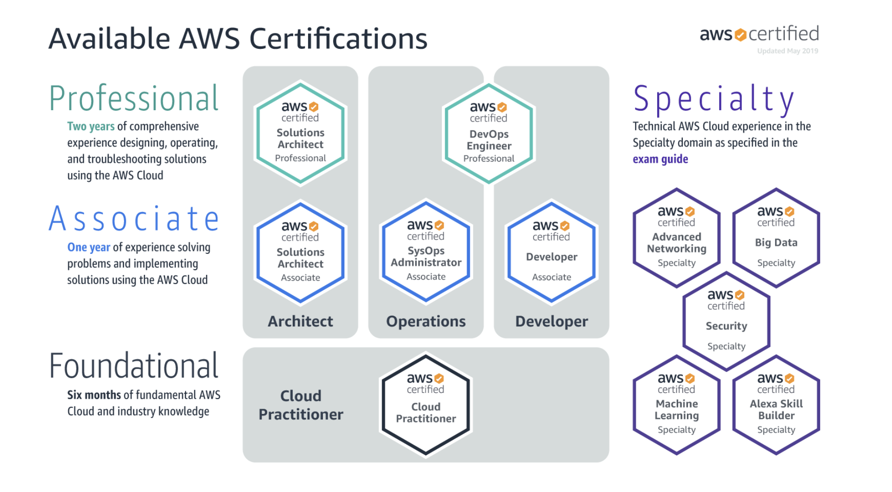
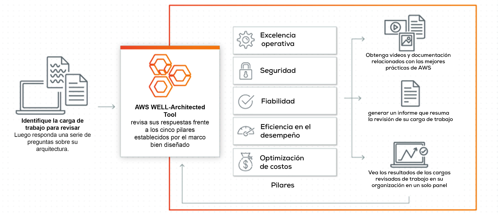

# AWS Certified Solutions Architect Associate (Study Guide)

### Mapa de Certificaciones de AWS (2020)

### Recursos oficiales de AWS

[Prepárese para los exámenes de AWS Certification](https://aws.amazon.com/es/certification/certification-prep/?nc2=sb_ce_ep)

### Guia Oficial de AWS

[Official Exam Guide by AWS](https://d1.awsstatic.com/training-and-certification/docs-sa-assoc/AWS-Certified-Solutions-Architect-Associate_Exam-Guide.pdf)

### Colorful and playful Cloud Diagrams & Notes by Jerry Hargrove

[awsgeek.com](https://www.awsgeek.com/)

### AWS Well-Architected

[AWS Well-Architected ayuda a los arquitectos de la nube a crear una infraestructura para aplicaciones y cargas de trabajo segura, de alto rendimiento, resistente y eficiente.](https://aws.amazon.com/es/architecture/well-architected/?wa-lens-whitepapers.sort-by=item.additionalFields.sortDate&wa-lens-whitepapers.sort-order=desc)

### Preguntas de ejemplo by AWS
[Descargue la guía del examen (SAA-C02)](https://d1.awsstatic.com/training-and-certification/docs-sa-assoc/AWS-Certified-Solutions-Architect-Associate_Sample-Questions.pdf)

### AWS Whitepapers
[Documentos técnicos y guías de AWS](https://aws.amazon.com/es/whitepapers/?whitepapers-main.sort-by=item.additionalFields.sortDate&whitepapers-main.sort-order=desc)

### AWS Console
[Consola de administración de AWS](https://aws.amazon.com/es/console/)

### Mapas Mentales para el SAA
[Mapa mental AWS en mindmeister.com](https://www.mindmeister.com/es/1179061789/aws-certified-solutions-architect-associate)

### Alojar un sitio web estatico
[Alojar un sitio web sencillo de marketing o una aplicación web en AWS](https://aws.amazon.com/es/getting-started/hands-on/host-static-website/)

### AWS FAQs: Muchas Preguntas son obtenidas de los FAQs (Frequiently Asked Questions de Amazon Web Services)
[FAQs Ingles](https://aws.amazon.com/faqs/?nc1=h_ls)

[FAQs Español](https://aws.amazon.com/es/faqs/?nc1=h_ls)

### AWS Quick Starts:Implementaciones de referencia creadas por arquitectos de Amazon Web Services (AWS) y partners.

[AWS Quick Starts](https://aws.amazon.com/quickstart/?nc1=h_ls&solutions-all.sort-by=item.additionalFields.sortDate&solutions-all.sort-order=desc&awsf.filter-tech-category=*all&awsf.filter-industry=*all&awsf.filter-source-category=*all&awsf.filter-content-type=*all)

### Get Hands-on Practice with AWS

[Intro to AWS labs](https://aws.amazon.com/training/intro-to-aws-labs/)

[amazon.qwiklabs.com](https://amazon.qwiklabs.com/)

### AWS Well-Architected Tool
[AWS Well-Architected Tool](https://us-west-2.console.aws.amazon.com/wellarchitected/home?region=us-west-2#/welcome)

To be updated very soon.

Guide being hold to June 2021

